# Diagrama de Clases — Sudoku Proyecto MVC

Diagrama UML de los scripts del proyecto y cómo se conectan, con sus funciones y variables principales.

```mermaid
classDiagram
    direction LR

    %% ===================== CORE / REGLAS =====================
    class SudokuRules {
        <<static>>
        +enum SudokuVariant : Variant2x3, Standard3x3, Variant3x4, Standard4x4
        +static CurrentVariant
        +static int Size
        +static int BoxRows
        +static int BoxCols
        +static int MaxValue
        +static int CellCount
        +static SetVariant(variant)
        +static SetVariant(size, boxRows, boxCols)
        +static GetCellIndex(row, col) int
        +static GetRow(index) int
        +static GetCol(index) int
        +static GetBoxIndex(row, col) int
        +static ValueToLabel(value) string
        +static LabelToValue(label) int
    }

    %% ===================== SESSION =====================
    class SessionContext {
        <<ScriptableObject>>
        +SelectedSlot int
        +LoadFromSave bool
        +SelectedDifficulty Difficulty
        +SelectedVariant SudokuVariant
        +GameState SudokuGameState
        +MaxHints int
        +MaxMistakes int
    }

    class SudokuGameState {
        <<enum>>
        Generating
        Playing
        Paused
        Victory
        Defeat
    }

    %% ===================== GENERADOR / SOLVER =====================
    class SudokuGenerator {
        +Generate(difficulty) SudokuBoardData
        -_solver SudokuSolver
        -_evaluator SudokuDifficultyEvaluatorPro
    }

    class SudokuSolver {
        +CountSolutions(board) int
    }

    class SudokuHumanSolver {
        +techniquesUsed List~string~
        +Solve(ctx) bool
    }

    class SudokuSolverEngine {
        +Step(ctx, out hint) bool
        +GetTechniqueNames() List~string~
    }

    class SudokuTechniqueFactory {
        <<static>>
        +Build(difficulty) List~ISudokuTechnique~
    }

    class ISudokuTechnique {
        <<interface>>
        +Name string
        +TryApply(ctx, out hint) bool
    }

    class NakedSingleTechnique
    class HiddenSingleTechnique
    class NakedPairTechnique
    class PointingPairTechnique
    class XWingTechnique
    ISudokuTechnique <|-- NakedSingleTechnique
    ISudokuTechnique <|-- HiddenSingleTechnique
    ISudokuTechnique <|-- NakedPairTechnique
    ISudokuTechnique <|-- PointingPairTechnique
    ISudokuTechnique <|-- XWingTechnique

    class SudokuDifficultyEvaluatorPro {
        +Evaluate(techniques) Difficulty
    }

    class SudokuSolverUtils {
        <<static>>
        +CountBits(mask) int
        +GetSingleValue(mask) int
        +GetRowUnit(row) int[]
        +GetColUnit(col) int[]
        +GetBoxUnit(box) int[]
    }

    %% ===================== DATOS =====================
    class SudokuBoardData {
        <<Serializable>>
        +int[] values
        +int[] solution
        +bool[] fixedCells
        +bool[] hintCells
        +int[] notesMask
        +float time
        +int difficulty
        +Clone() SudokuBoardData
    }

    class SudokuContext {
        +int[,] board
        +int[] notesMask
        +CanPlace(r, c, n) bool
    }

    class SudokuBitMask {
        +Clear()
        +Init(board)
        +CanPlace(r, c, n) bool
        +Place(r, c, n)
        +Remove(r, c, n)
    }

    class SudokuMove {
        <<struct>>
        +int index
        +int oldValue
        +int newValue
        +int oldNotes
        +int newNotes
    }

    class SudokuAction {
        <<struct>>
        +SudokuActionType type
        +int index
        +int value
        +int mask
        +string technique
    }

    class SudokuActionType {
        <<enum>>
        Place
        RemoveNotes
    }

    class SudokuHint {
        +string technique
        +List~int~ highlightCells
        +List~int~ affectedCells
        +int candidateMask
        +List~SudokuAction~ actions
    }

    class NotesUtil {
        <<static>>
        +Toggle(ref mask, number)
    }

    %% ===================== INFRAESTRUCTURA =====================
    class SudokuSceneRef {
        <<static>>
        +IsSceneInstance(obj) bool
        +ResolveT(current) T
        +ResolvePanel(current, type) GameObject
        +ResolveSessionT(current) T
        +FindFirstObjectByTypeT() T
        +FindInSceneT(predicate) T
    }

    class SudokuSaveManager {
        <<MonoBehaviour>>
        +SaveGame(slot)
        +LoadGame(slot) bool
        +DeleteSlot(slot)
        +HasSlot(slot) bool
        +GetSlotData(slot) SudokuSaveData
    }

    class SaveService {
        +Save(data, slot)
        +Load(slot, out data) bool
        +Delete(slot)
        +Exists(slot) bool
    }

    class SudokuSaveData {
        <<Serializable>>
        +board SudokuBoardData
        +initialBoard SudokuBoardData
        +float time
        +int difficulty
        +List~SudokuMove~ undoStack
        +int undoBarrierIndex
        +int mistakes
        +int[] previewValues
        +int remainingHints
    }

    class SudokuAutoSave {
        <<MonoBehaviour>>
        -saveManager SudokuSaveManager
        -board SudokuBoardController
        -sessionContext SessionContext
        +suscribe a OnBoardChanged / OnApplicationQuit
    }

    class SudokuTimer {
        <<MonoBehaviour>>
        +StartTimer()
        +StopTimer()
        +GetTime() float
        +SetTime(time)
        +SetTimerText(text)
        +ResetTime()
    }

    %% ===================== CONTROLADORES =====================
    class SudokuGameManager {
        <<MonoBehaviour>>
        -sessionContext SessionContext
        -boardView SudokuBoardView
        -timer SudokuTimer
        -boardController SudokuBoardController
        -variant SudokuRules.SudokuVariant
        -flowController SudokuGameFlowController
        -highlightSystem SudokuHighlightSystem
        +enum Difficulty : Easy, Medium, Hard, Expert, Extreme
        +PauseGame()
        +ResumeGame()
        +SetGameState(state)
    }

    class SudokuBoardController {
        <<MonoBehaviour>>
        +boardData SudokuBoardData
        +event OnBoardChanged
        +SetBoardData(data)
        +SetInitialState(data)
        +ResetBoard()
        +ApplyMove(move)
        +Undo()
        +ToggleNote(index, number)
        +AutoFillNotes()
        +CheckWin() bool
        +IsCorrect(r, c, value) bool
        +ApplyActions(actions, fromHint)
        +LockCompletedNumber(number) bool
        +GetBoardData() SudokuBoardData
        +GetUndoStack() List~SudokuMove~
        +GetUndoBarrierIndex() int
        +NotifyBoardChanged()
    }

    class SudokuInputController {
        <<MonoBehaviour>>
        +RemainingHints int
        +event OnHintsChanged
        +SetNumber(number)
        +SelectCell(cell)
        +ToggleNotesMode()
        +UseHint()
        +ResetHints()
        +SetRemainingHints(hints)
        +ClearSelection()
    }

    class SudokuGameFlowController {
        <<MonoBehaviour>>
        +Initialize()
        +RestartLevel()
        +OpenNewGamePanel()
        +ConfigureEndGamePanels(victory, victoryButtons, defeat, defeatActions, difficultyPanel)
    }

    class SudokuSessionController {
        <<MonoBehaviour>>
        +StartNewGame(slot, difficulty, variant)
        +ContinueGame(slot, variant)
        +SaveCurrentSlot()
        +SaveAndGoToMenu()
    }

    class SudokuMenuSlotsController {
        <<MonoBehaviour>>
        -saveManager SudokuSaveManager
        -sessionController SudokuSessionController
        -slotItemPrefab SudokuSaveSlotItem
        -difficultyPanel SudokuDifficultySelectionPanel
    }

    %% ===================== SISTEMAS =====================
    class SudokuMistakeSystem {
        <<MonoBehaviour>>
        +MaxMistakes int
        +event OnMistakeChanged(int)
        +event OnGameOver
        +Configure(context)
        +Init(savedMistakes)
        +RegisterMistake()
        +GetMistakes() int
    }

    class SudokuHintSystem {
        <<MonoBehaviour>>
        +MaxHints int
        +Configure(context)
        +TryGetHint(out hint) bool
    }

    class SudokuHighlightSystem {
        <<MonoBehaviour>>
        +Init(cells, controller)
        +SelectCell(cell)
        +SetNotesMode(active)
        +SetNotesButtonImage(image)
        +ShowHint(hint)
    }

    %% ===================== VISTA DEL TABLERO =====================
    class SudokuBoardView {
        <<MonoBehaviour>>
        -cellPrefab GameObject
        -boxes Transform[] (generadas en runtime)
        +CreateBoard()
        +GetCells() SudokuCell[,]
        +UpdateBoard(values, fixedCells, notesMask, hintCells)
        +SetCellError(row, col, active, number)
        +ClearAllErrors()
    }

    class SudokuCell {
        <<MonoBehaviour>>
        +row int
        +column int
        +OnCellClicked$ Action~SudokuCell~
        +Render(value, isFixed, isHintLocked, notesMask)
        +SetHighlight(color)
        +SetError(active, number)
        +OnClick()
    }

    %% ===================== UI: CONSTRUCTOR =====================
    class SudokuGameUI {
        <<MonoBehaviour -100>>
        +prefabs: numberButton, numberPanel, victoryPanel, defeatPanel,
        +        difficultyPanel, topBar, actionRow, pausePanel, sudokuGrid
        +boardBottomOffset float
        +boardTopOffset float
        +settingsPanelComp GameObject
        +ventajas: construye TODA la UI en runtime
        +ApplyHudTheme(themeIndex)
        +playerPrefs: Volumen / Vidas / Color
    }

    class NumberPanel {
        <<MonoBehaviour>>
        +OnNumberPressed$ Action~int~
        +Instance$ NumberPanel
        +InitButtons()
        +PressNumber(number)
        +ClearNumber()
        +SetNumberButtonInteractable(number, state)
        +IsNumberButtonInteractable(number) bool
        +dos filas para 3x4 y 4x4 (12/16 botones)
    }

    class SudokuNumberButton {
        <<MonoBehaviour>>
        +Configure(number, label)
        +Press()
    }

    class SudokuLivesUI {
        <<MonoBehaviour>>
        +Setup(hearts, fullHeart, emptyHeart)
        +UpdateLives(mistakes)
    }

    class SudokuHintsUI {
        <<MonoBehaviour>>
        +Setup(text, button)
        +UpdateHints(remaining)
    }

    class SudokuDifficultyUI {
        <<MonoBehaviour>>
        +Setup(text)
        +SetDifficulty(diff)
    }

    class SudokuPauseUI {
        <<MonoBehaviour>>
        +SettingsPanel GameObject
        +Setup(panel, pauseButton)
        +ClosePause()
        +OpenPause()
        +Resume()
        +RestartGame()
        +NewGame()
        +GoToMenu()
        +OpenSettings()
        +CloseSettings()
    }

    class SudokuDifficultySelectionPanel {
        <<MonoBehaviour>>
        +event OnDifficultySelected(int slot, Difficulty)
        +Setup(title, buttons, cancel)
        +Open(slot)
        +Close(fromCancel)
    }

    class SudokuVictoryPanel {
        <<MonoBehaviour>>
        +ReturnToMenu()
    }

    class SudokuDefeatPanel {
        <<MonoBehaviour>>
        +Restart()
        +NewGame()
    }

    class SudokuSaveSlotItem {
        <<MonoBehaviour>>
        +event OnContinueRequested(int)
        +event OnDeleteRequested(int)
        +event OnCreateRequested(int)
        +Init(index, title)
        +RenderEmpty()
        +RenderSaved(difficulty, time)
    }

    %% ===================== CONEXIONES =====================

    %% Capa Core
    SudokuGenerator --> SudokuSolver
    SudokuGenerator --> SudokuHumanSolver
    SudokuGenerator --> SudokuDifficultyEvaluatorPro
    SudokuGenerator --> SudokuBoardData
    SudokuHumanSolver --> SudokuSolverEngine
    SudokuSolver --> SudokuBitMask
    SudokuSolverEngine --> SudokuTechniqueFactory
    SudokuTechniqueFactory --> ISudokuTechnique
    SudokuDifficultyEvaluatorPro --> SudokuRules
    SudokuRules <-- SudokuBoardData
    SudokuContext ..> SudokuRules : validaciones
    SudokuBitMask ..> SudokuRules

    %% Controladores -> Sesión y Core
    SudokuGameManager ..> SessionContext : fuente de verdad
    SudokuGameManager ..> SudokuRules : SetVariant
    SudokuBoardController --> SudokuBoardData
    SudokuBoardController --> SudokuBitMask
    SudokuBoardController ..> SudokuRules
    SudokuInputController --> SudokuBoardController
    SudokuInputController --> SudokuBoardView
    SudokuInputController --> SudokuHintSystem
    SudokuInputController --> SudokuHighlightSystem
    SudokuInputController --> SudokuMistakeSystem
    SudokuInputController ..> SessionContext : estado del juego
    SudokuGameFlowController --> SudokuGenerator
    SudokuGameFlowController --> SudokuBoardView
    SudokuGameFlowController --> SudokuBoardController
    SudokuGameFlowController --> SudokuInputController
    SudokuGameFlowController --> SudokuSaveManager
    SudokuGameFlowController --> SudokuTimer
    SudokuGameFlowController --> SudokuMistakeSystem
    SudokuGameFlowController --> SudokuHighlightSystem
    SudokuGameFlowController ..> SessionContext

    %% Sesión y guardado
    SudokuSessionController ..> SessionContext
    SudokuSessionController --> SudokuSaveManager
    SudokuMenuSlotsController --> SudokuSaveManager
    SudokuMenuSlotsController --> SudokuSessionController
    SudokuMenuSlotsController --> SudokuSaveSlotItem
    SudokuMenuSlotsController --> SudokuDifficultySelectionPanel
    SudokuSaveManager --> SaveService
    SudokuSaveManager --> SudokuSaveData
    SudokuSaveManager --> SudokuBoardController
    SudokuSaveManager --> SudokuTimer
    SudokuSaveManager --> SudokuMistakeSystem
    SudokuSaveManager --> SudokuInputController
    SudokuSaveManager ..> SessionContext
    SudokuSaveData --> SudokuBoardData
    SudokuSaveData --> SudokuMove
    SudokuAutoSave --> SudokuSaveManager
    SudokuAutoSave --> SudokuBoardController : OnBoardChanged
    SudokuAutoSave ..> SessionContext

    %% Vista del tablero
    SudokuBoardView --> SudokuCell
    SudokuBoardView ..> SudokuRules
    SudokuCell ..> SudokuRules : ValueToLabel/BoxRows

    %% Sistemas
    SudokuHintSystem --> SudokuHumanSolver : motores de pistas
    SudokuHintSystem --> SudokuBoardController
    SudokuHintSystem ..> SessionContext
    SudokuMistakeSystem ..> SessionContext : MaxMistakes
    SudokuHighlightSystem --> SudokuCell
    SudokuHighlightSystem --> SudokuBoardController
    SudokuHighlightSystem ..> SudokuHint

    %% El constructor de la UI (Canvas) se conecta con todo
    SudokuGameUI --> SudokuBoardController
    SudokuGameUI --> SudokuBoardView
    SudokuGameUI --> SudokuInputController
    SudokuGameUI --> SudokuGameFlowController
    SudokuGameUI --> SudokuTimer
    SudokuGameUI --> SudokuHighlightSystem
    SudokuGameUI --> SudokuMistakeSystem
    SudokuGameUI --> SudokuPauseUI
    SudokuGameUI --> SudokuLivesUI
    SudokuGameUI --> SudokuHintsUI
    SudokuGameUI --> SudokuDifficultyUI
    SudokuGameUI --> NumberPanel
    SudokuGameUI --> SudokuDifficultySelectionPanel
    SudokuGameUI ..> SudokuRules : ConfigureVariant
    SudokuGameUI ..> SessionContext

    %% Paneles de UI
    NumberPanel --> SudokuNumberButton
    SudokuNumberButton ..> NumberPanel : Instance.PressNumber
    SudokuPauseUI ..> SudokuGameManager : PauseGame/ResumeGame
    SudokuPauseUI ..> SudokuSessionController : SaveCurrentSlot
    SudokuPauseUI ..> SudokuGameFlowController : RestartLevel
    SudokuVictoryPanel --> SudokuSessionController : SaveAndGoToMenu
    SudokuDefeatPanel --> SudokuGameFlowController : RestartLevel/NewGame

    %% Eventos estáticos (datos -> controladores)
    SudokuCell --|> SudokuInputController : OnCellClicked
    NumberPanel --|> SudokuInputController : OnNumberPressed
    SudokuInputController --|> SudokuGameFlowController : OnHintsChanged
    SudokuMistakeSystem --|> SudokuGameFlowController : OnMistakeChanged / OnGameOver
    SudokuBoardController --|> SudokuGameFlowController : OnBoardChanged
    SudokuBoardController --|> SudokuAutoSave : OnBoardChanged
    SudokuSaveSlotItem --|> SudokuMenuSlotsController : slot events
    SudokuDifficultySelectionPanel --|> SudokuMenuSlotsController : OnDifficultySelected
```

## Cómo se conectan (resumen del flujo)

### Arranque de una partida (MainMenu → escena de Sudoku)
1. `SudokuMenuSlotsController` muestra los slots con `SudokuSaveSlotItem` (eventos `OnContinueRequested` / `OnCreateRequested` / `OnDeleteRequested`).
2. Al elegir, `SudokuSessionController` escribe en `SessionContext` (`SelectedSlot`, `SelectedDifficulty`, `SelectedVariant`, `LoadFromSave`) y carga la escena en modo Single.
3. En la escena, `SudokuGameUI` (Canvas, ejecución -100) es el **constructor central**: destruye la UI vieja, configura la variante en `SudokuRules` y construye todo en runtime a partir de los prefabs (grid, DatosNivel, PanelAjustes, NumberPanel, paneles).
4. `SudokuGameManager` arranca: resuelve referencias con `SudokuSceneRef.Resolve`, llama `CreatBoard()` a `SudokuBoardView` (que autogenera cajas y celdas según `SudokuRules.BoxRows/BoxCols`) e inicializa `SudokuHighlightSystem` y `SudokuGameFlowController`.

### Flujo de partida
- `SudokuCell.OnClick` (evento estático) → `SudokuInputController.SelectCell`.
- `NumberPanel.OnNumberPressed` (evento estático) → `SudokuInputController.SetNumber` → `SudokuBoardController.ApplyMove` (valida con `SudokuBitMask`, guarda undo) → dispara `OnBoardChanged`.
- `OnBoardChanged` → `SudokuGameUI`/`SudokuGameManager` redibujan con `SudokuBoardView.UpdateBoard`, `SudokuGameFlowController` revisa `CheckWin`.

### Pistas y errores
- `SudokuInputController.UseHint` → `SudokuHintSystem.TryGetHint` → `SudokuHumanSolver`/`SudokuSolverEngine` + técnicas (`ISudokuTechnique`) → devuelve `SudokuHint` → `SudokuHighlightSystem.ShowHint` y `SudokuBoardController.ApplyActions`.
- Error: `SudokuMistakeSystem.RegisterMistake` → `OnMistakeChanged` (refresca `SudokuLivesUI`) y `OnGameOver` (derrota si llega al máximo).

### Guardado
- `SudokuSaveManager` (con `SaveService` → JSON en disco) guarda `SudokuSaveData` (tablero, undo, tiempo, errores, pistas). `SudokuAutoSave` suscribe `OnBoardChanged` y `OnApplicationQuit`.
- Sin vidas (ajuste `Sudoku_LivesEnabled = 0`): no se cuentan errores, se permite escribir cualquier número y se gana al completar el tablero; los corazones se ocultan.